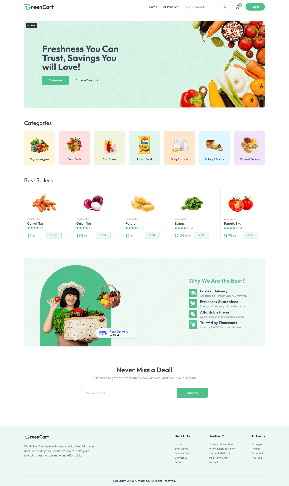
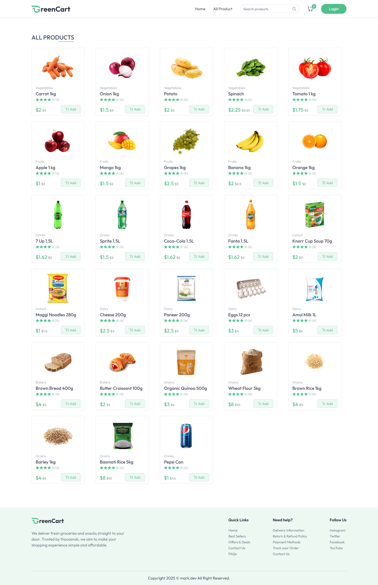
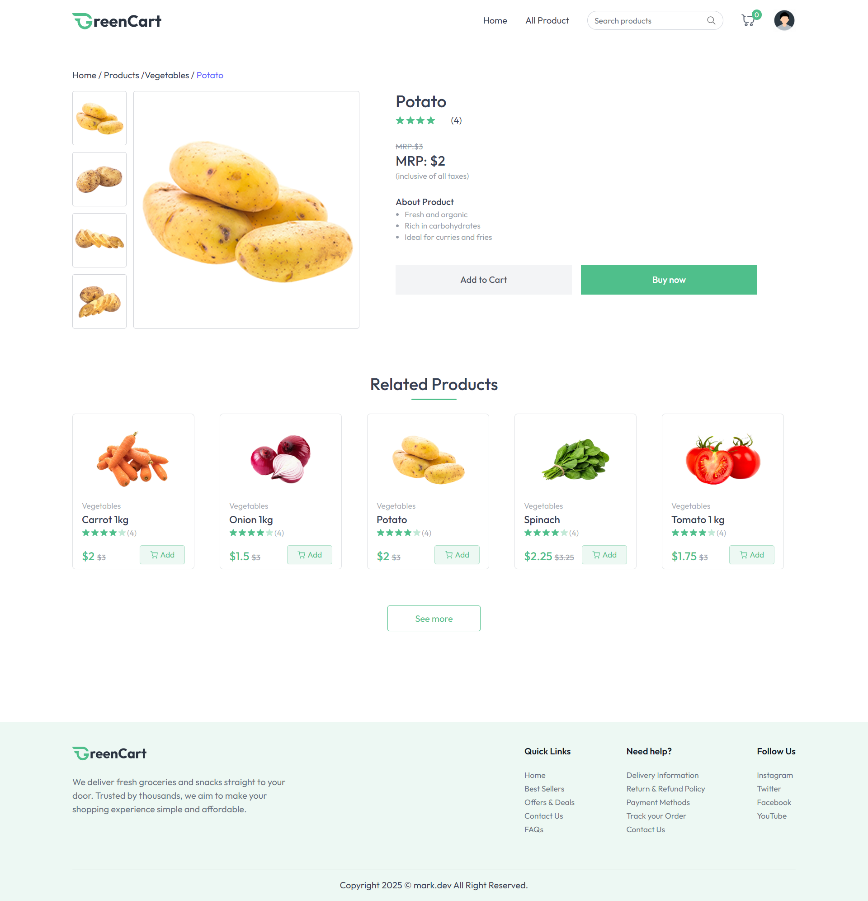
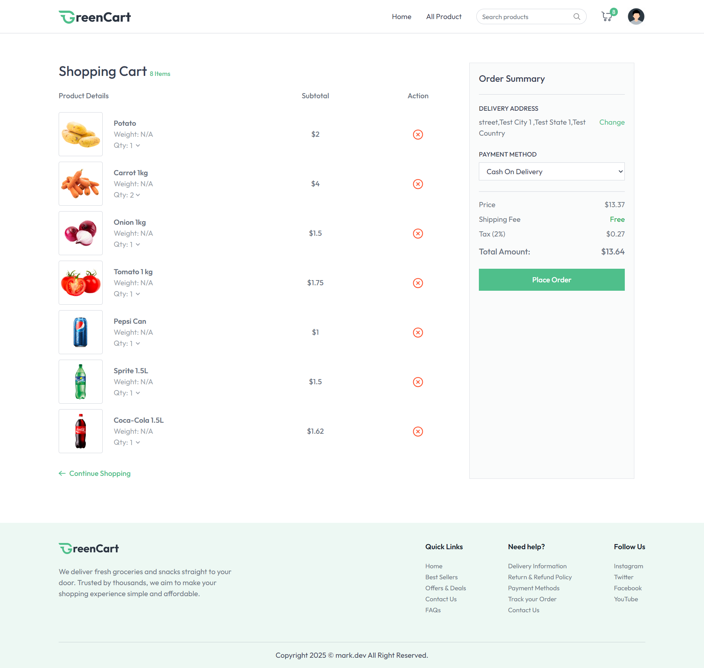
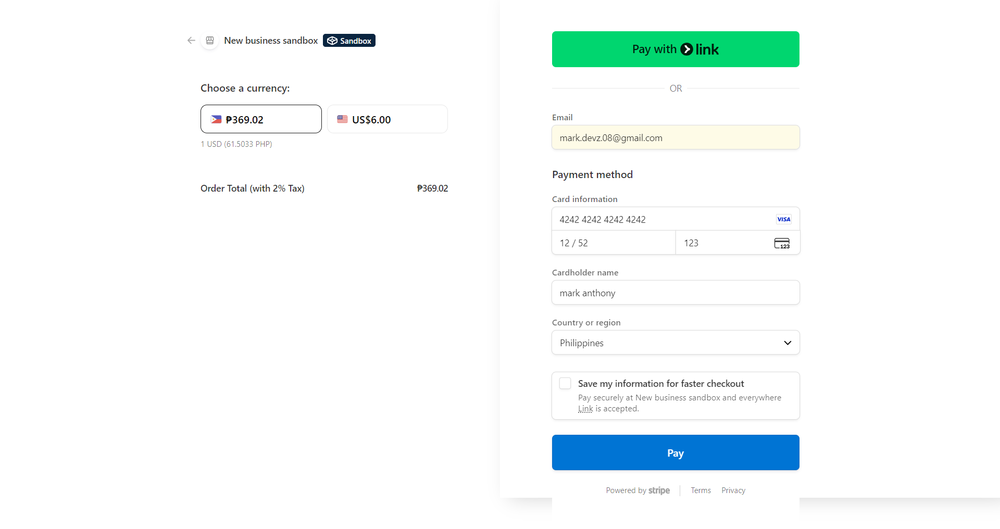
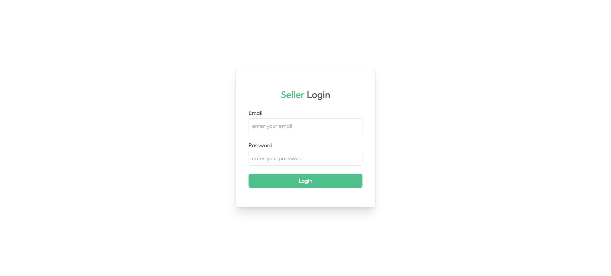
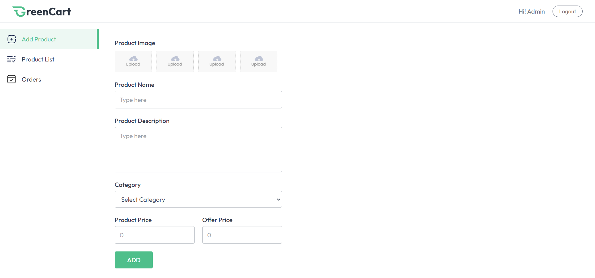
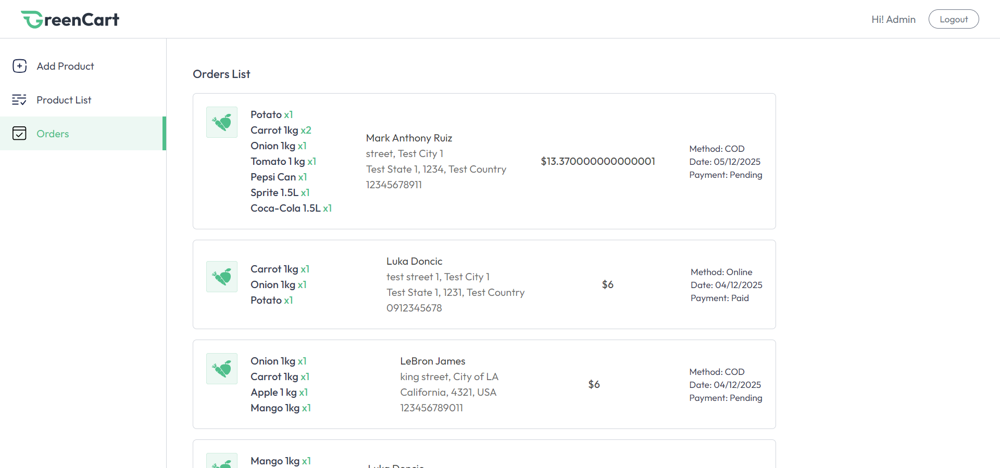

# 📦 GreenCart — MERN E-Commerce Platform

Modern full-stack grocery e-commerce web application built with React, Node.js, Express, and MongoDB, featuring authentication, cart management, product admin tools, online payments, and Cloudinary image uploads.

### 🚀 Deployment & Live Link

[![View Live Demo]](https://greencart-m.vercel.app)

<br>

## 🏷️ Badges

<p align="left">       </p> <br>


## 🚀 Tech Stack
#### Frontend
<p align="left">  </p>

#### Backend
<p align="left">  </p>

#### Tools
<p align="left">  </p>


## Table of Contents

### Overview

- [Overview](#overview)
- [Features](#features)
- [Project Structure](#project-structure)
- [Environment Variables](#environment-variables)
- [Installation](#installation)
- [API Endpoints](#api-endpoints)
- [Project Screenshots](#project-screenshots)
- [Author](#author)


## Overview

GreenCart is a full-stack e-commerce application that provides user authentication, product browsing, cart management, checkout, order tracking, and seller/admin product control.

This project demonstrates:

* Full MERN stack mastery

* Authentication with JWT + cookies

* Real-world Cloudinary image upload

* Stripe checkout with webhooks

* Scalable backend MVC folder structure


## Features

### ⚙️ Frontend Features
#### 🛍️ Storefront

* Product listing

* Product details page

* Add to cart

* Dynamic cart count

#### 👤 User System

* Login / Register

* Persistent auth state

* Manage addresses

#### 💳 Checkout

* Cash on Delivery

* Stripe payment

#### 🛠️ Seller/Admin Panel

* Add products

* Manage stock

* View all orders

### ⚙️ Backend Features

#### 👤 User Auth

* Register / Login

* JSON Web Token (JWT) authentication

* Auth-protected routes

* Secure cookies (httpOnly, sameSite, secure)

#### 🛒 Cart

* Add / update cart

* Cart sync with database

#### 📦 Products

* Cloudinary image upload

* Seller/Admin protected

* Update stock

* Product listing + filter

#### 📬 Address

* Save address

* Retrieve address

* Connected to orders

#### 🧾 Orders

* COD checkout

* Stripe payment (webhooks supported)

* User order history

* Admin full order list


## 📁Project Structure

```text
greencart/
   │
   ├── client/        # React frontend
   ├── server/        # Node.js backend
   ├── screenshots/   # Images for README
   ├── README.md
   └── .gitignore
```


## Environment Variables
Backend .env

* PORT=4000
* NODE_ENV=development
* JWT_SECRET=your_jwt
* MONGODB_URI=your_mongodb_uri

### Seller login
* SELLER_EMAIL=your_admin_email
* SELLER_PASSWORD=your_admin_password

#### Cloudinary
* CLOUDINARY_CLOUD_NAME=
* CLOUDINARY_API_KEY=
* CLOUDINARY_API_SECRET=

#### Stripe
* STRIPE_PUBLISHABLE_KEY=
* STRIPE_SECRET_KEY=
* STRIPE_WEBHOOK_SECRET=


Frontend .env

* VITE_BACKEND_URL=http://localhost:4000
* VITE_CURRENCY=$


## Installation

🧪 Run Locally
1. Clone Repo

```text
git clone https://github.com/YOUR_USERNAME/greencart.git
cd greencart
```

#### Backend
```text
cd server
npm install
npm run server
```

#### Frontend
```text
cd client
npm install
npm run dev
```

## API Endpoints

### User Routes
```text
POST   /api/user/register
POST   /api/user/login
GET    /api/user/is-auth
GET    /api/user/logout
```

### Product Routes
```text
POST   /api/product/add
POST   /api/product/stock
GET    /api/product/list
GET    /api/product/id?id=<productId>
```

### Cart Route
POST   /api/cart/update

### Address Routes
```text
POST   /api/address/add
GET    /api/address/get
```

### Order Routes
```text
POST   /api/order/cod
POST   /api/order/stripe
GET    /api/order/user
GET    /api/order/seller
```


## Project Screenshots

### Home


### Product List



### Product Details



### Product Cart



### Product Checkout-Stripe



### Seller Login



### Seller Add Product



### Seller Order Management



## Author

Mark Anthony Ruiz

Full Stack Developer


